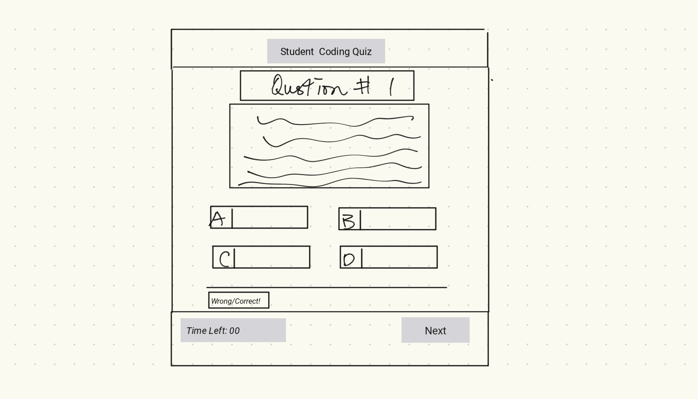

# 04 Web APIs: Code Quiz

- [Explore the docs]( https://github.com/jenho-webdev/quiz-me)

- [Deployed Application](https://jenho-webdev.github.io/quiz-me/)

- [Report Bug](https://github.com/jenho-webdev/quiz-me/issues/)

- [Request Feature](https://github.com/jenho-webdev/quiz-me/issues)

<!-- TABLE OF CONTENTS -->

## Table of Contents

- [About The Project](#about-the-project)

- [User Story](#user-story)

- [Acceptance Criteria](#acceptance-criteria)

- [Mock-up](#mock-up)

- [Roadmap](#roadmap)

- [Contact](#contact-me)

- [Acknowledgments](#acknowledgments)

## About the App

As you progress on your journey to becoming a full-stack web developer, you will likely encounter coding assessments, which may be part of an interview process. These assessments typically include both multiple-choice questions and interactive coding challenges.

Our app is designed to help you familiarize yourself with these types of tests and questions. Specifically, it allows you to take a timed multiple-choice quiz on JavaScript fundamentals. The app runs in the browser and features dynamically updated HTML and CSS, powered by JavaScript code. The user interface is clean, polished, and responsive.

In future releases of the app, we plan to add interactive coding questions and an updated pool of questions. For more information on our upcoming features, please see the roadmap section of this document.

## User Story

    As a coding boot camp student, I want to take a timed quiz on JavaScript fundamentals that stores high scores locally, and allows me to review all stored scores and gamers' initials.
   
## Acceptance Criteria

    Given that I am taking a code quiz:

    [X]WHEN I click the start button, 
    [THEN] a timer should start, and I should be presented with a question.
    [X]WHEN I answer a question, 
    [X]THEN I should be presented with another question.
    [X]WHEN I answer a question incorrectly, 
    [X]THEN 5 seconds should be subtracted from the clock.
    [X]WHEN all 10 questions are answered, or the timer reaches 0, 
    [THEN] the game should be over.
    [X]WHEN the game is over
    [X]THEN I should be able to save my initials and my score.
    [X]WHEN I attempt to save my initials,
    [X]THEN the system should verify that the input is not empty.
    [x]WHEN the input is empty, 
    [THEN] the system should alert me until I input something into the initials text field.
    [X]WHEN there is text/characters in the initials text field, and I hit the save button,
    [X]THEN the game should save the user's initials and score into local storage.
    [X] WHEN system done saving the score,
    [X]THEN the system should provide an alert to confirm the save was successful and give the gamer an option to start a new game or view saved scores.
    [X]WHEN I click on the "view score" button,
    [x]THEN a sorted list of saved user scores and initials should be displayed, along with a button to start a new game.
    [X]WHEN I click on the "Start a New Game" button on the view scores page, 
    [X]THEN a new game should start.

## Wireframe

## Mock-Up

The following animation demonstrates the application functionality:

## Roadmap

- Allow user to select the total number of questions that they will be quiz on in an incremental of 10.
- Instead of using time remaining and -5sec for wrong answer as a scoring system. Develop a more robust scoring system that will scale with different number of questions set.
- Support interactive coding questions
- Include HTML and CSS questions
- support emailing result to user.

## Contact Me

[![LinkedIn][linkedin-shield]](https://www.linkedin.com/in/jen-h-202a1723/)
[![Github][Github-shield]](https://github.com/jenho-webdev/Personal-Portfolio)
[![Slack][slack-shield]](https://jenworkspace-as73396.slack.com/archives/C052QLTJQHG)

## Acknowledgments

- Shield and badges used in this markdown document were sourced from [Shields.io](https://shields.io/).
- The site sound clips were provided by UCI Bootcamp Course.
- This website was inspired by UCIBookcamp Week 4 Assignment. The user story, acceptance criteria were built ontop of the original in the UCI Bootcamp Full Stack WebDev Course.

<!-- MARKDOWN LINKS & IMAGES -->

[linkedin-shield]: https://img.shields.io/badge/-LinkedIn-black.svg?style=for-the-badge&logo=linkedin&colorB=555
[Github-shield]:https://img.shields.io/badge/GitHub-100000?style=for-the-badge&logo=github&logoColor=white
[slack-shield]:https://img.shields.io/badge/Slack-4A154B?style=for-the-badge&logo=slack&logoColor=white
 